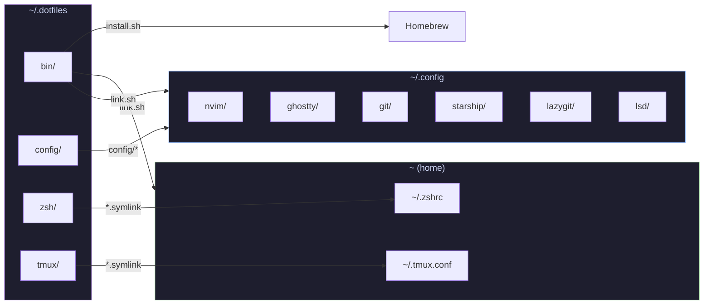
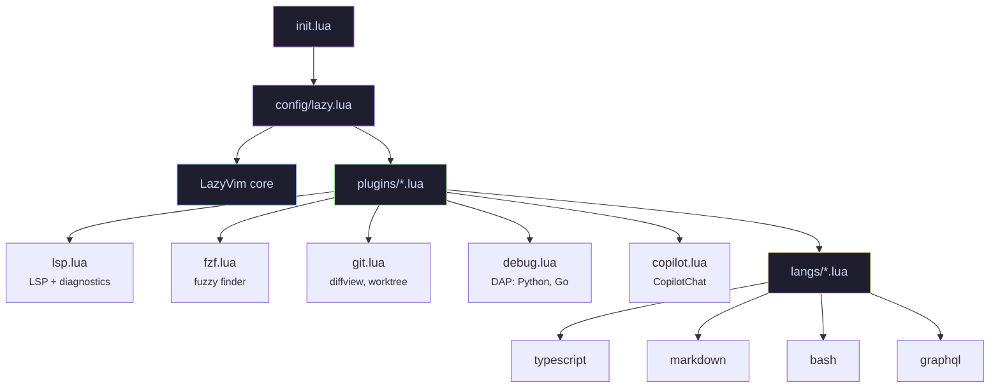

# dotfiles

[](#)
[](#neovim)
[](#neovim)
[](#shell)
[](#tmux)
[](#languages)
[](#languages)
[](#languages)

A portable development environment for macOS — one command to set up a fully configured terminal, editor, and dev toolchain.

## Quick Start

```bash
git clone https://github.com/derekahn/dotfiles.git ~/.dotfiles
cd ~/.dotfiles
make setup
```

For CI / non-interactive installs:

```bash
export GIT_USER_NAME="your-username"
export GIT_USER_EMAIL="your-email@example.com"
make setup
```

## Architecture


```mermaid
graph LR
    subgraph dotfiles["~/.dotfiles"]
        bin["bin/"]
        config["config/"]
        zsh["zsh/"]
        tmux["tmux/"]
    end

    subgraph home["~ (home)"]
        zshrc["~/.zshrc"]
        tmuxconf["~/.tmux.conf"]
    end

    subgraph dotconfig["~/.config"]
        nvim["nvim/"]
        ghostty["ghostty/"]
        git["git/"]
        starship["starship/"]
        lazygit["lazygit/"]
        lsd["lsd/"]
    end

    bin -->|install.sh| Homebrew
    bin -->|link.sh| home
    bin -->|link.sh| dotconfig

    zsh -->|"*.symlink"| zshrc
    tmux -->|"*.symlink"| tmuxconf
    config -->|"config/*"| dotconfig

    style dotfiles fill:#1e1e2e,stroke:#cba6f7,color:#cdd6f4
    style home fill:#1e1e2e,stroke:#a6e3a1,color:#cdd6f4
    style dotconfig fill:#1e1e2e,stroke:#89b4fa,color:#cdd6f4
```

### Symlink Strategy

Two patterns handled by `bin/link.sh`:

| Pattern | Example | Target |
|---------|---------|--------|
| `**/*.symlink` | `zsh/zshrc.symlink` | `~/.zshrc` |
| `config/*` | `config/nvim/` | `~/.config/nvim/` |

## What's Included

### Shell

[Zsh](https://www.zsh.org/) with [Zinit](https://github.com/zdharma-continuum/zinit) plugin manager, modular configuration via `zsh/*.zsh` files:

| Module | Purpose |
|--------|---------|
| `git.zsh` | Aliases & functions (`gaap`, `gsp`, `gac`, `gbc`, `lg`) |
| `go.zsh` | GOPATH setup, test/bench aliases, coverage |
| `rust.zsh` | Cargo/rustup PATH |
| `node.zsh` | Volta-managed Node.js |
| `docker.zsh` | Docker aliases |
| `k8s.zsh` | Kubernetes aliases |
| `python.zsh` | Pyenv setup |
| `utility.zsh` | Misc helpers (compression, zsh profiling) |

**Shell enhancements:** [Starship](https://starship.rs/) prompt, [Atuin](https://atuin.sh/) history sync, [Zoxide](https://github.com/ajeetdsouza/zoxide) smart cd, [fzf](https://github.com/junegunn/fzf) fuzzy finder

### Neovim

[LazyVim](https://www.lazyvim.org/) distribution with custom plugin layer:


```mermaid
graph TD
    init["init.lua"] --> lazy["config/lazy.lua"]
    lazy --> lazyvim["LazyVim core"]
    lazy --> plugins["plugins/*.lua"]

    plugins --> lsp["lsp.lua<br/><small>LSP + diagnostics</small>"]
    plugins --> fzf["fzf.lua<br/><small>fuzzy finder</small>"]
    plugins --> git["git.lua<br/><small>diffview, worktree</small>"]
    plugins --> debug["debug.lua<br/><small>DAP: Python, Go</small>"]
    plugins --> copilot["copilot.lua<br/><small>CopilotChat</small>"]
    plugins --> langs["langs/*.lua"]

    langs --> ts["typescript"]
    langs --> md["markdown"]
    langs --> bash["bash"]
    langs --> gql["graphql"]

    style init fill:#1e1e2e,stroke:#cba6f7,color:#cdd6f4
    style lazy fill:#1e1e2e,stroke:#cba6f7,color:#cdd6f4
    style lazyvim fill:#1e1e2e,stroke:#89b4fa,color:#cdd6f4
    style plugins fill:#1e1e2e,stroke:#a6e3a1,color:#cdd6f4
    style langs fill:#1e1e2e,stroke:#f9e2af,color:#cdd6f4
```

**Theme:** [Catppuccin Mocha](https://github.com/catppuccin/nvim) with transparent background

**Key bindings:**

| Key | Action |
|-----|--------|
| `<leader>/` | Grep (fzf-lua live grep) |
| `<C-p>` | Find files (including hidden) |
| `<C-f>` | Find files (filename first) |
| `<leader>w` | Save |
| `<leader>k` | Hide pane |
| `<leader>e` | File explorer (Neo-tree) |
| `<leader>ck` | Insert debug log |
| `gp` | Preview definition |
| `ga.` | Text case conversion |

### Tmux

Prefix: `Ctrl+a` — vi-mode copy, smart vim-tmux navigation

| Key | Action |
|-----|--------|
| `prefix + \|` | Split horizontal |
| `prefix + -` | Split vertical |
| `prefix + h/j/k/l` | Navigate panes |
| `prefix + H/J/K/L` | Resize panes |
| `prefix + C-m` | Fuzzy session switcher |
| `prefix + r` | Reload config |

### Terminal

[Ghostty](https://ghostty.org/) with Catppuccin Mocha theme, DankMono Nerd Font

### Languages

| Language | Manager | LSP | Extras |
|----------|---------|-----|--------|
| Go | Homebrew | gopls | godoc, impl, staticcheck, delve, gomodifytags |
| Rust | rustup | rust-analyzer | rustfmt, rust-src |
| TypeScript | Volta | ts_ls + eslint | prettier, neotest-jest |
| Python | System | pyright | DAP, black |
| Lua | — | lua_ls | stylua |

### CLI Tools

| Category | Tools |
|----------|-------|
| Files | [bat](https://github.com/sharkdp/bat), [lsd](https://github.com/lsd-rs/lsd), [fd](https://github.com/sharkdp/fd), [ripgrep](https://github.com/BurntSushi/ripgrep), [ncdu](https://dev.yorhel.nl/ncdu), [duf](https://github.com/muesli/duf), [tokei](https://github.com/XAMPPRocky/tokei) |
| Git | [lazygit](https://github.com/jesseduffield/lazygit), [git-delta](https://github.com/dandavison/delta), [difftastic](https://github.com/Wilfred/difftastic) |
| JSON | [fx](https://github.com/antonmedv/fx), [dasel](https://github.com/TomWright/dasel) |
| Network | [httpie](https://httpie.io/), [croc](https://github.com/schollz/croc) |
| Linting | [shellcheck](https://www.shellcheck.net/), [shfmt](https://github.com/mvdan/sh), [yamllint](https://github.com/adrienverge/yamllint), [jsonlint](https://github.com/zaach/jsonlint) |

## Makefile

```
make setup       # One-click setup (install + link)
make install     # Homebrew, packages, languages (Go, Rust, Node)
make link        # Create symlinks for all configs
make link-force  # Force-replace existing symlinks
make update      # Update Homebrew, zsh plugins, tmux plugins
make clean       # Remove broken symlinks
make lint        # Run shellcheck on scripts
```

## Post-Install

1. Restart your terminal or `source ~/.zshrc`
2. In tmux: `prefix + I` to install plugins
3. Open `nvim` — LazyVim installs plugins automatically
